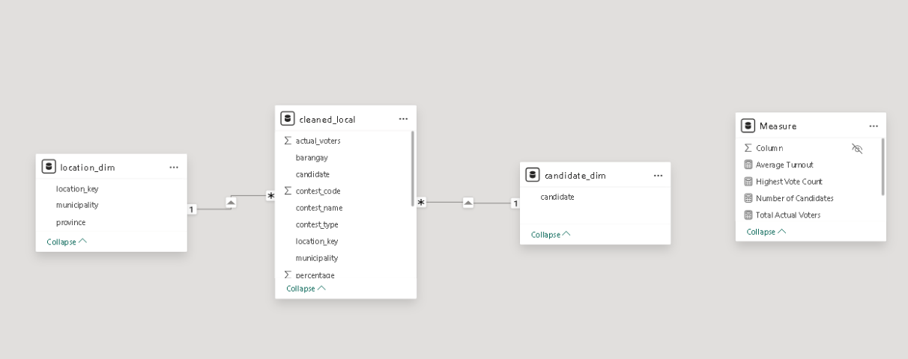
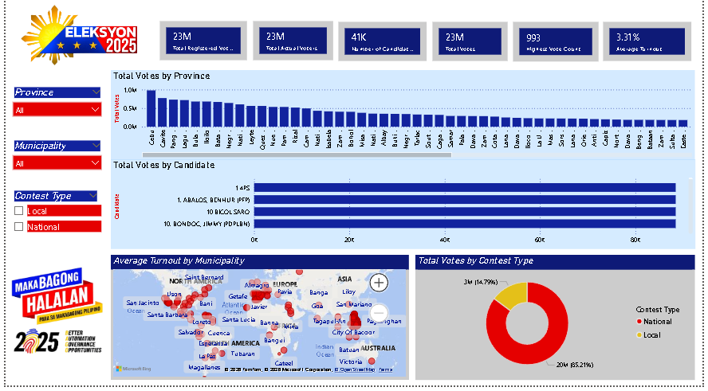

# Philippine Elections 2025 — Data Analytics Dashboard
### 7Analytics Activity | City College of Angeles

---

## Overview

This project is a data analytics activity using real election data from the 2025 Philippine national and local elections. The dataset was sourced from Kaggle and originally comes from COMELEC. The goal was to clean the data, build a proper data model, compute key metrics using DAX, and present the findings through an interactive Power BI dashboard.

The full documentation website is live at:
**[View the Dashboard Documentation Site →](https://danposi23-0184.github.io/7Analytics-dashboard/)** 

**[Download the pbix→](https://drive.google.com/file/d/1qMXushlSabvKSvL9d1QILn9SSGtPTAaq/view?usp=sharing)**

**[View our Documentation on gdocx explaining each steps and how the 3 frameworks were used for this dataset→](https://docs.google.com/document/d/1oTqiiBnp8u-q2vWt4lcpU-3MNzyHW3Zynm9S13P6zPg/edit?usp=sharing)**

---

## Dataset

| Detail | Info |
|---|---|
| Source | Kaggle — gelcloudy/philippine-elections-2025-dataset-comelec |
| File Used | combined_local.csv |
| Coverage | Local and national election results, 2025 Philippine elections |
| Original Rows | 999,000+ |
| Original Columns | 17 |

---

## Tools Used

- **Power BI Desktop** — data modeling, DAX measures, dashboard
- **Power Query Editor** — data cleaning and transformation
- **Data Model View** — star schema setup and relationship management
- **DAX** — calculated measures for key metrics
- **GitHub Pages** — hosting the documentation website

---

## Data Cleaning Steps

All cleaning was done inside Power Query Editor in Power BI.

1. **Removed blank rows** — dropped rows with missing candidate names and null vote values
2. **Corrected data types** — set numerical columns to number types, text columns to text type
3. **Removed duplicates** — eliminated duplicate records to avoid double-counting
4. **Removed voting_center column** — not needed for the planned dashboard visuals
5. **Standardized text formatting** — applied Text.Proper to province, municipality, barangay, contest_type, and contest_name
6. **Added location_key column** — combined province and municipality into a single key column in both cleaned_local and location_dim to resolve a many-to-many relationship issue

---

## Data Model

The project uses a **star schema** with one fact table and two dimension tables.

Both relationships are **one-to-many** with **single cross-filter direction**.

---

## DAX Measures

| Measure | Formula |
|---|---|
| Total Registered Voters | `COUNTROWS(cleaned_local[registered_voters])` |
| Total Actual Voters | `SUM(cleaned_local[actual_voters])` |
| Average Turnout | `AVERAGE(cleaned_local[percentage]) / 100` |
| Total Votes | `SUM(cleaned_local[votes])` |
| Highest Vote Count | `MAX(cleaned_local[votes])` |
| Number of Candidates | `DISTINCTCOUNT(cleaned_local[candidate])` |

---

## Key Metrics

| Metric | Value |
|---|---|
| Total Registered Voters | 17bn |
| Total Actual Voters | 14bn |
| Number of Candidates | 41K |
| Total Votes | 1bn |
| Highest Vote Count | 993 |
| Average Turnout | 3.31% |

---

## Key Findings

1. **Cebu ranked first** among all provinces in total votes, followed by Cavite — reflecting high population density and voter participation.
2. **Bong Go (PDPLBN) topped the candidate chart** with nearly 30 million votes, followed by Aquino, Bam (KNP) and Dela Rosa, Bato (PDPLBN).
3. **National races accounted for 59.96%** of total votes (657M) vs. 40.04% for local races (439M).
4. **Luzon showed the densest voter activity** on the municipality map, with several areas marked as high-turnout hotspots.
5. **All three slicers** (Province, Municipality, Contest Type) filter all visuals correctly, confirming the data model relationships are working.

---

## Dashboard Preview

---

## Repository Contents

| File | Description |
|---|---|
| `index.html` | Full documentation website (hosted via GitHub Pages) |
| `dashboard.png` | Screenshot of the Power BI dashboard |
| `README.md` | This file |

---

## How to View

- **Live site:** `https://danposi23-0184.github.io/7Analytics-dashboard/`
- **Locally:** Download `index.html`,`styles.css` and `dashboard.png` into the same folder, then open `index.html` in any browser

---

*Submitted for 7Analytics | City College of Angeles*
